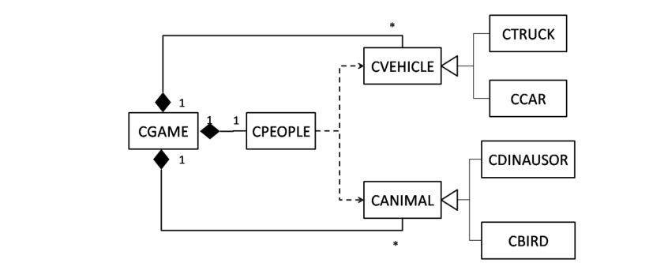

# 🎮 Crossing Road Game

In this project, we will combine techniques, basic data structures, and object-oriented programming knowledge to build a road crossing game. To implement this project, we need basic knowledge such as: file handling, threads, handles, basic data structures and object-oriented programming knowledge...

## 🧑‍🔧 Game scenario

- `W`, `A`, `S`, `D` to correct the direction of the passers-by and try to avoid other vehicles and animals.

- If you collide with vehicles or animals, the program prompts the player to select the 'y' key if he wants to continue (the program will reset the game data to the original) or select 'any key' if want to exit the game

- If you pass all the cars and animals, you will go to the next level, the difficulty of the game is the number of cars and animals involved in moving on the road.

## ⚙️ Support techniques

- Fixed home screen
- Set the position for the screen pointer
- Multi-threaded

## ⌨ Classes in the game

- `CPEOPLE`: People moving through traffic lanes
- `CVEHICLE`: Car will run, basically class car
- `CANIMAL`: Similar to class VEHICLE
- `CGAME`: Game center role will coordinate all objects in the game

## 📜 Class diagram

## 👉 Game

